## 1.前言 ✍️
### 1.1 介绍
这是一个基于**Python DrissionPage**编写的，运行在**Github Action**上的贴吧每日签到运行脚本，默认每天在北京时间**凌晨2:30**(可根据需要进行修改)定时运行。

**Github项目地址**：[Tieba_auto_sign](https://github.com/1dyer/Tieba_auto_sign)
**个人博客地址**：[贴吧每日自动签到脚本](https://blog.ldyer.top/2025/08/29/%E8%B4%B4%E5%90%A7%E6%AF%8F%E5%A4%A9%E7%AD%BE%E5%88%B0%E8%84%9A%E6%9C%AC/)


### 1.2 运行样例
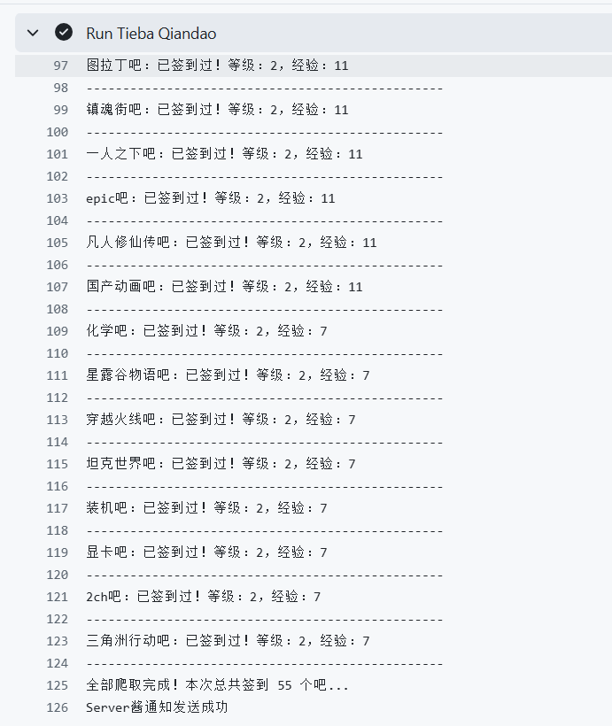
## 2.准备工具 📝

- 能正常使用的贴吧账号
- 能访问Github的网络环境
- 能运行Python代码的编译器（为了前期获取你的账号Cookie）

## 3.演示 👾
### 3.1 Fork仓库
首先**Fork**本仓库，最好能再点击下旁边的**Star** （
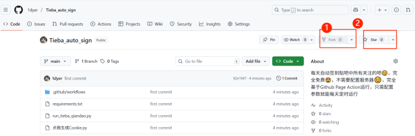
### 3.2 获取Cookie
打开仓库中的**点我生成Cookie**的Python文件，将其中的代码复制到你自己本地上，然后运行。
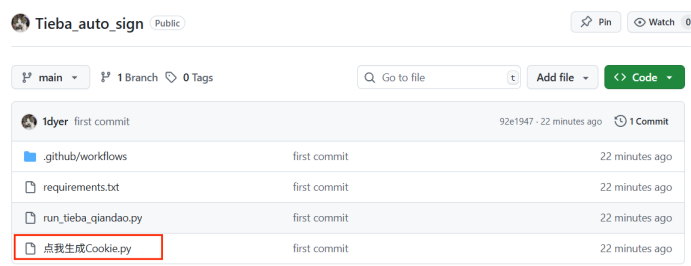
所需要的库是**DrissionPage**，如果你原先没有，请下载该库：
```bash
pip install dirssionpage
```
准备就绪后，运行改代码，这时候会跳出一个**贴吧登录页面**，这时候你需要拿出手机，进行扫码登录。
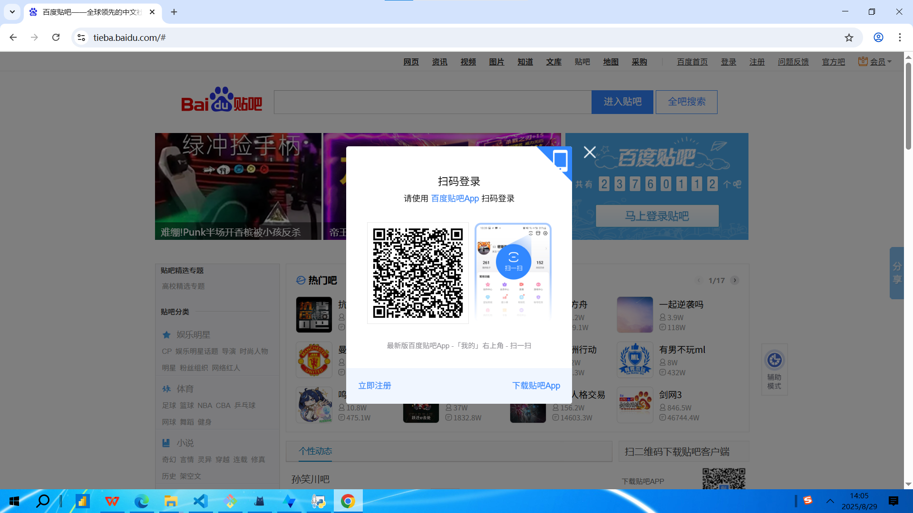
扫码登录成功之后，请按照代码运行终端上的要求，按下回车键。
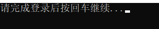
这个时候，和代码**同目录**下会生成一个**tieba_cookies**的JSON文件，你的账号Cookie信息就准备好了。
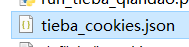
然后回到你Github的仓库中(注意，是你自己的)，点击**Setting** -> **Secrets and variables** -> **Action**,进入秘钥配置界面。 
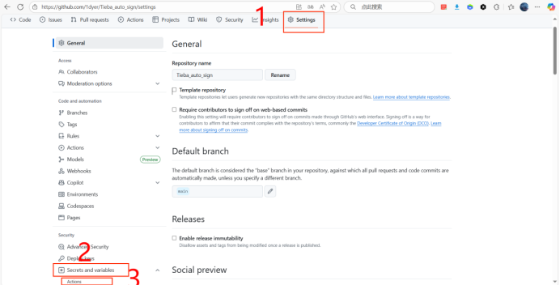
点击**New repository secret**

在**Name**中填入 “**TIEBA_COOKIES**”这个变量名，然后再下方的**Secret**中填入刚刚**tieba_cookies**的JSON文件里生成的Cookie，然后点击提交。
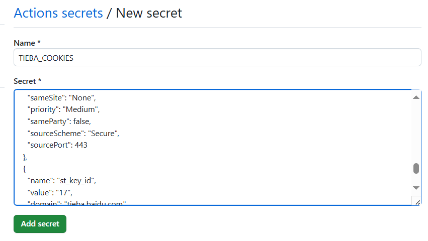
现在，你的Cookie就配置好了。
### 3.3 配置Server酱通知
每天脚本自动签到成功后，可以将签到成功的信息通过微信发给你，以便你了解签到情况。
首先得获取它的**SendKey**，你得访问它的官网[Server酱](https://sct.ftqq.com/sendkey),登录你的微信，然后获取**SendKey**

获取**SendKey**完毕后，继续点击**Setting** -> **Secrets and variables** -> **Action**,进入秘钥配置界面，增加新的秘钥。
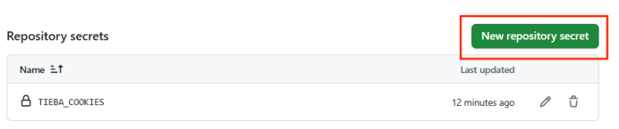
**Name**填写“**SendKey**”变量名，然后**Secret**中填写刚刚复制的**SendKey**的值，最后提交。
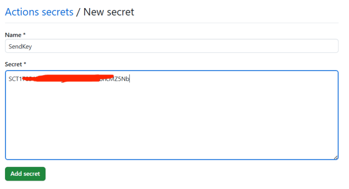
### 3.4 测试运行
回到你的仓库，点击**Action** -> **Tieba QianDao** -> **Run workflow** -> **Run workflow**
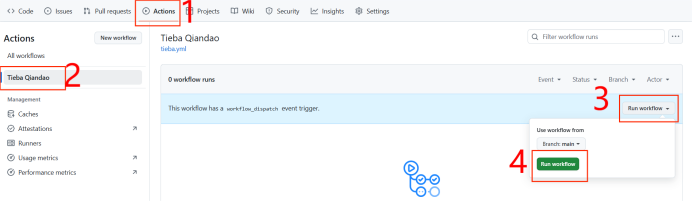
点击之后，它就会运行了，这时候刷新页面就能看到运行状态了。
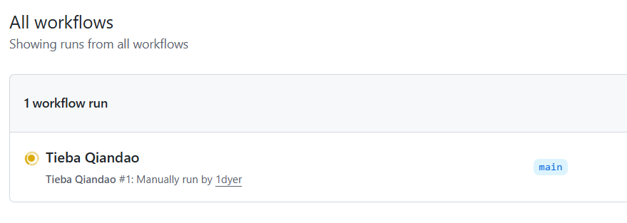
这时候一直点进去，可以看到运行过程。
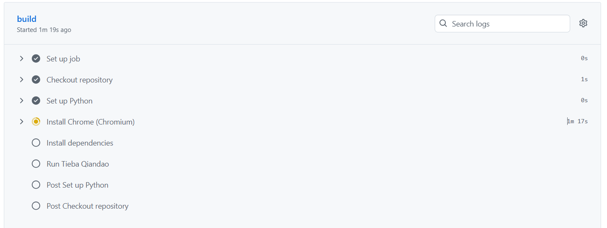
等待运行时间结束后，就能看到运行结果了。

微信上的通知：
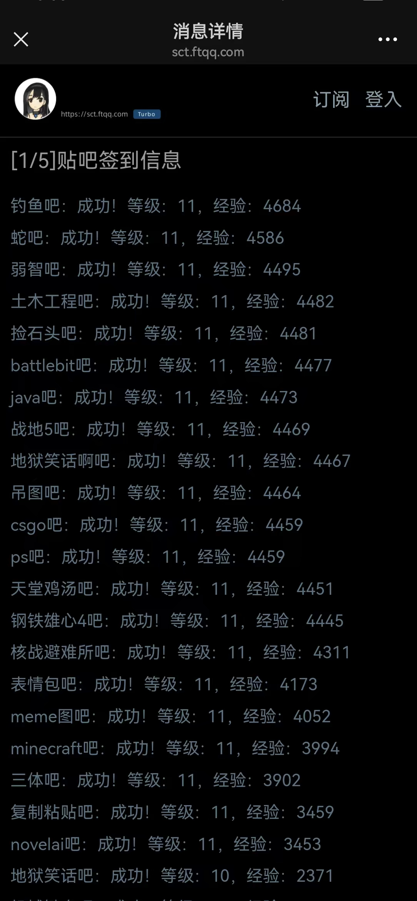

## 4. 源码原理解析 🔍
整个脚本主要分为以下几个部分：

### 4.1. Cookie 读取
```python
def read_cookie():
    if "TIEBA_COOKIES" in os.environ:
        return json.loads(os.environ["TIEBA_COOKIES"])
```
- 从环境变量**TIEBA_COOKIES**中读取 JSON 格式的 Cookie，用于模拟登录百度贴吧。
### 4.2 浏览器配置
```python
co = ChromiumOptions().headless()
chromium_path = shutil.which("chromium-browser")
if chromium_path:
    co.set_browser_path(chromium_path)
page = ChromiumPage(co)
```
- 使用**DrissionPage**创建**Chromium**浏览器对象，启用 无头模式（后台运行，不弹出窗口）。
- 自动检测chromium-browser的路径，并绑定。
### 4.3 模拟登录贴吧
```python
page.get("https://tieba.baidu.com/")
page.set.cookies(read_cookie())
page.refresh()
page._wait_loaded(15)
```
- 打开贴吧首页，并注入 Cookie。
- 刷新页面后即可进入已登录状态。
### 4.4 获取关注的贴吧列表
```python
page.get(f"https://tieba.baidu.com/i/i/forum?&pn={yeshu}")
element = page.ele('xpath://*[@id="like_pagelet"]/div[1]/div[1]/table/tbody/tr[{i}]/td[1]/a/@href')
```
- 访问个人主页的贴吧列表页面，循环翻页获取所有已关注的贴吧。
- 使用 XPath 提取贴吧链接和名称。

### 4.5 签到逻辑
```python
is_sign_ele = page.ele('xpath://*[@id="signstar_wrapper"]/a/span[1]')
if is_sign.startswith("连续"):
    # 已签到
else:
    sign_ele = page.ele('xpath://a[@class="j_signbtn sign_btn_bright j_cansign"]')
    sign_ele.click()
```
- 打开每个贴吧，检查是否已经签到：

        如果已签到 → 输出等级、经验信息。

        如果未签到 → 找到“签到”按钮并点击。

- 签到后刷新页面，重新抓取等级与经验。
### 4.6 等级与经验获取
```python
def get_level_exp(page):
    level_ele = page.ele('xpath://.../div[3]/div[1]/a/div[2]').text
    exp_ele = page.ele('xpath://.../div[3]/div[2]/a/div[2]/span[1]').text
```
- 通过 XPath 定位用户的贴吧等级和经验值。

- 若未找到，则返回 "未知"。

### 4.7 通知推送
```python
if "SendKey" in os.environ:
    api = f'https://sc.ftqq.com/{os.environ["SendKey"]}.send'
    requests.post(api, data=data, timeout=60)
```
- 若配置了 SendKey，会调用 Server酱 API 发送签到结果。

- 推送内容包含签到情况（成功、已签到、失败等）。

### 4.8 运行流程总结 🏗
- 读取 Cookie → 模拟登录贴吧

- 获取已关注的贴吧列表 → 循环遍历

- 判断是否已签到 → 执行签到操作

- 获取等级和经验 → 保存日志

- 签到完成后，推送通知（可选）

## 5. 源码
```python
from DrissionPage import ChromiumOptions, ChromiumPage
import json
import os
import shutil
import time
import requests

def read_cookie():
    """读取 cookie，优先从环境变量读取"""
    if "TIEBA_COOKIES" in os.environ:
        return json.loads(os.environ["TIEBA_COOKIES"])
    else:
        print("贴吧Cookie未配置！详细请参考教程！")
        return []

def get_level_exp(page):
    """获取等级和经验，如果找不到返回'未知'"""
    try:
        level_ele = page.ele('xpath://*[@id="pagelet_aside/pagelet/my_tieba"]/div/div[1]/div[3]/div[1]/a/div[2]').text
        level = level_ele if level_ele else "未知"
    except:
        level = "未知"
    try:
        exp_ele = page.ele('xpath://*[@id="pagelet_aside/pagelet/my_tieba"]/div/div[1]/div[3]/div[2]/a/div[2]/span[1]').text
        exp = exp_ele if exp_ele else "未知"
    except:
        exp = "未知"
    return level, exp

if __name__ == "__main__":
    print("程序开始运行")

    # 通知信息
    notice = ''


    co = ChromiumOptions().headless()
    chromium_path = shutil.which("chromium-browser")
    if chromium_path:
        co.set_browser_path(chromium_path)

    page = ChromiumPage(co)

    url = "https://tieba.baidu.com/"
    page.get(url)
    page.set.cookies(read_cookie())
    page.refresh()
    page._wait_loaded(15)


    over = False
    yeshu = 0
    count = 0

    while not over:
        yeshu += 1
        page.get(f"https://tieba.baidu.com/i/i/forum?&pn={yeshu}")

        page._wait_loaded(15)

        for i in range(2, 22):
            element = page.ele(
                f'xpath://*[@id="like_pagelet"]/div[1]/div[1]/table/tbody/tr[{i}]/td[1]/a/@href'
            )
            try:
                tieba_url = element.attr("href")
                name = element.attr("title")
            except:
                msg = f"全部爬取完成！本次总共签到 {count} 个吧..."
                print(msg)
                notice += msg + '\n\n'
                page.close()
                over = True
                break

            page.get(tieba_url)
            

            page.wait.eles_loaded('xpath://*[@id="signstar_wrapper"]/a/span[1]',timeout=30)


            # 判断是否签到
            is_sign_ele = page.ele('xpath://*[@id="signstar_wrapper"]/a/span[1]')
            is_sign = is_sign_ele.text if is_sign_ele else ""
            if is_sign.startswith("连续"):
                level, exp = get_level_exp(page)
                msg = f"{name}吧：已签到过！等级：{level}，经验：{exp}"
                print(msg)
                notice += msg + '\n\n'
                print("-------------------------------------------------")
            else:
                page.wait.eles_loaded('xpath://a[@class="j_signbtn sign_btn_bright j_cansign"]',timeout=30)
                sign_ele = page.ele('xpath://a[@class="j_signbtn sign_btn_bright j_cansign"]')
                if sign_ele:
                    sign_ele.click()
                    time.sleep(1)  # 等待签到动作完成
                    page.refresh()


                    page._wait_loaded(15)

                    level, exp = get_level_exp(page)
                    msg = f"{name}吧：成功！等级：{level}，经验：{exp}"
                    print(msg)
                    notice += msg + '\n\n'
                    print("-------------------------------------------------")
                else:
                    msg = f"错误！{name}吧：找不到签到按钮，可能页面结构变了"
                    print(msg)
                    notice += msg + '\n\n'
                    print("-------------------------------------------------")

            count += 1
            page.back()
            page._wait_loaded(10)

    if "SendKey" in os.environ:
        api = f'https://sc.ftqq.com/{os.environ["SendKey"]}.send'
        title = u"贴吧签到信息"
        data = {
        "text":title,
        "desp":notice
        }
        try:
            req = requests.post(api, data=data, timeout=60)
            if req.status_code == 200:
                print("Server酱通知发送成功")
            else:
                print(f"通知失败，状态码：{req.status_code}")
                print(api)
        except Exception as e:
            print(f"通知发送异常：{e}")
    else:
        print("未配置Server酱服务...")
```


## ⚠️ 免责声明
- 本项目仅供学习与研究 Python 自动化及 GitHub Actions 使用。  
- 使用过程中可能涉及账号安全风险，请自行评估。  
- 请勿将本项目用于任何违反法律法规或百度贴吧使用条款的行为。  
- 因使用本项目造成的账号异常、封禁或其他损失，作者概不负责。